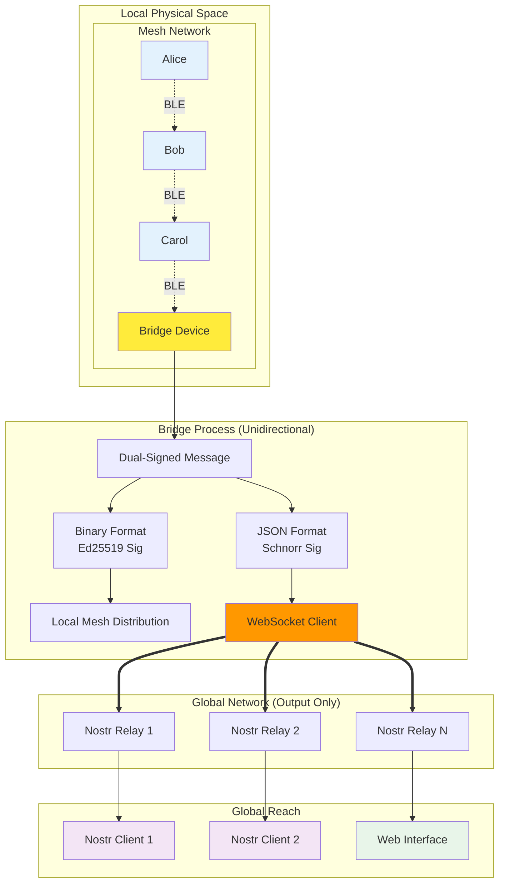
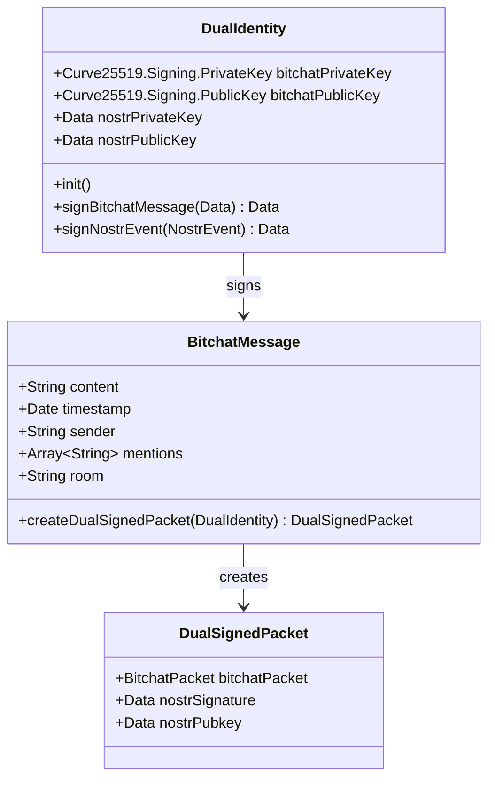
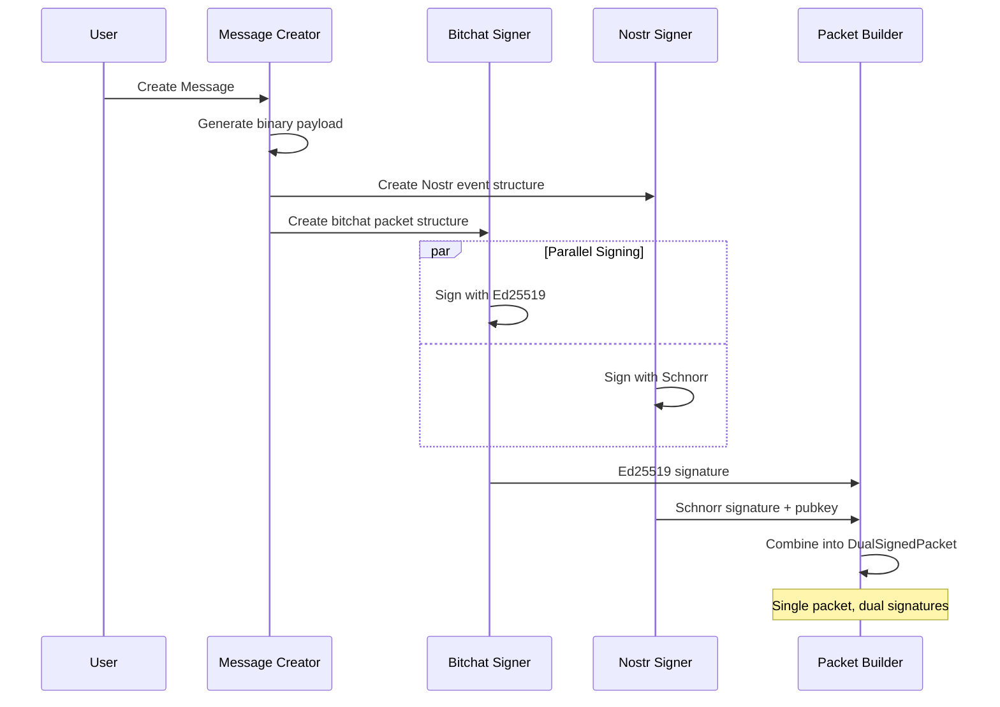
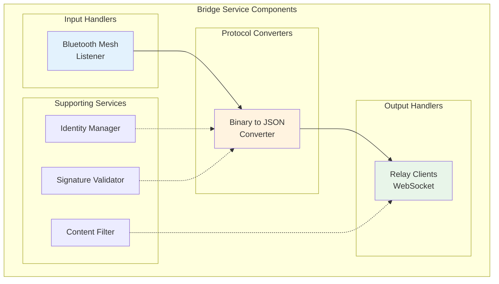
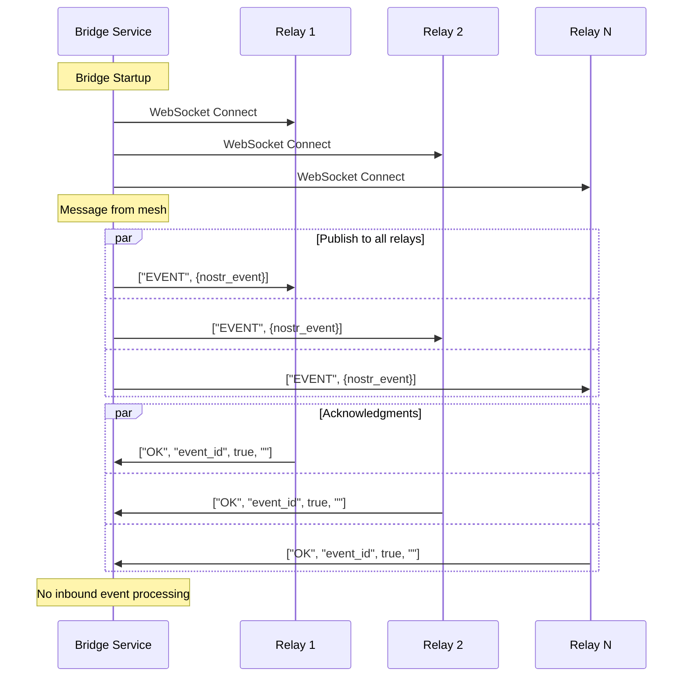

# bitchat-nostr Bridge Protocol Whitepaper

## Abstract

This document describes the bitchat-nostr bridge protocol, a dual-signing architecture that enables flexible bridging between bitchat's Bluetooth mesh networks and the Nostr decentralized social protocol. By implementing cryptographic dual signatures with configurable publishing options, messages can be transmitted through local mesh networks with optional global relay distribution, while maintaining the security and privacy guarantees of both protocols. This bridge extends bitchat's reach beyond Bluetooth range while preserving its core principles of decentralization and privacy.

## Table of Contents

1. [Introduction](#introduction)
2. [Architecture Overview](#architecture-overview)
3. [Dual Identity System](#dual-identity-system)
4. [Dual Signing Protocol](#dual-signing-protocol)
5. [Message Format Mapping](#message-format-mapping)
6. [Bridge Service Architecture](#bridge-service-architecture)
7. [WebSocket Relay Integration](#websocket-relay-integration)
8. [Privacy and Security](#privacy-and-security)
9. [Implementation Specifications](#implementation-specifications)
10. [Use Cases and Benefits](#use-cases-and-benefits)
11. [Future Considerations](#future-considerations)
12. [Conclusion](#conclusion)

## Introduction

bitchat provides secure, decentralized messaging over Bluetooth Low Energy mesh networks, enabling communication without internet infrastructure. However, this approach is inherently limited by Bluetooth range (~30m) and requires physical proximity between users. The Nostr protocol offers a complementary approach: a decentralized social network built on cryptographic signatures and WebSocket relays that can span global distances.

The bitchat-nostr bridge protocol extends bitchat's capabilities by providing:
- **Global reach** beyond Bluetooth mesh limitations
- **Message persistence** through Nostr relay storage
- **Cross-platform compatibility** with the Nostr ecosystem
- **Cryptographic integrity** preservation across protocols
- **Optional bridging** that maintains local mesh independence

### Key Innovation: Configurable Dual Signing

The core innovation is **configurable dual signing**: each bitchat message is simultaneously signed with both bitchat's Ed25519 keys and Nostr's secp256k1 Schnorr signatures at creation time, with explicit intent declaration. This enables messages originating in bitchat to be cryptographically valid in both the local mesh and optionally in global Nostr networks without requiring protocol modifications to either system.

### Bridge Options and Intent Declaration

A bridge options byte provides explicit control over message handling:

**Bridge Options Byte Format**:
```
Bit 7: Publishable Flag (1 = intended for Nostr relay publication, 0 = identity only)
Bits 6-1: Reserved for future use
Bit 0: Protocol Version (currently 0)
```

**Signing Modes**:
- **Identity Mode** (publishable=0): Signs with event ID 0x00000... for identity establishment without creating publishable events
- **Publishable Mode** (publishable=1): Signs with correct event ID for relay publication

This dual approach provides both **redundant verification** (bridge can detect signing mode) and **explicit intent** (prevents accidental publication of private messages).

## Architecture Overview

<div align="center">



</div>

## Dual Identity System

Each user maintains two separate cryptographic identities:

### Bitchat Identity (Ephemeral)
- **Purpose**: Local mesh network authentication
- **Algorithm**: Curve25519 (Ed25519 signatures)
- **Lifecycle**: Generated fresh each session
- **Scope**: Physical proximity networks
- **Privacy**: No persistent correlation across sessions

### Nostr Identity (Persistent)  
- **Purpose**: Global relay network authentication
- **Algorithm**: secp256k1 (Schnorr signatures)
- **Lifecycle**: Long-term persistent identity
- **Scope**: Global relay network
- **Privacy**: Consistent identity for social connections

<div align="center">



</div>

### Key Management Strategy

```swift
struct DualIdentity {
    // Ephemeral mesh identity
    let bitchatPrivateKey: Curve25519.Signing.PrivateKey
    let bitchatPublicKey: Curve25519.Signing.PublicKey
    
    // Persistent social identity  
    let nostrPrivateKey: Data  // 32-byte secp256k1
    let nostrPublicKey: Data   // 32-byte x-only pubkey
    
    init(restoreNostr: Data? = nil) {
        // Always generate fresh bitchat keys
        self.bitchatPrivateKey = Curve25519.Signing.PrivateKey()
        self.bitchatPublicKey = bitchatPrivateKey.publicKey
        
        // Restore or generate Nostr keys
        if let existing = restoreNostr {
            self.nostrPrivateKey = existing
            self.nostrPublicKey = derivePublicKey(from: existing)
        } else {
            let keyPair = generateNostrKeypair()
            self.nostrPrivateKey = keyPair.private
            self.nostrPublicKey = keyPair.public
        }
    }
}
```

## Dual Signing Protocol

The dual signing process creates a single message package that contains valid signatures for both protocols:

### Signing Flow

<div align="center">



</div>

### Cryptographic Operations

**Bitchat Signature (Ed25519)**:
```swift
// Sign the binary payload + timestamp
let packetContent = payload + timestamp.bigEndianData
let bitchatSignature = try bitchatPrivateKey.signature(for: packetContent)
```

**Nostr Signature (Configurable)**:
```swift
// Create Nostr event structure
let eventArray = [0, pubkey, created_at, kind, tags, content]
let eventJSON = JSONSerialization.data(withJSONObject: eventArray)

// Choose event ID based on publishable flag
let eventId: String
if bridgeOptions.isPublishable {
    // Use real event ID for publishable events
    eventId = SHA256.hash(data: eventJSON).compactMap { 
        String(format: "%02x", $0) 
    }.joined()
} else {
    // Use 0x00000... for identity-only mode
    eventId = String(repeating: "0", count: 64)
}

// Create signing payload with chosen event ID
let signingArray = [0, pubkey, created_at, kind, tags, content]
let signingJSON = JSONSerialization.data(withJSONObject: signingArray)
let eventHash = SHA256.hash(data: signingJSON)
let nostrSignature = schnorrSign(eventHash, privateKey: nostrPrivateKey)
```

### Packet Structure

```
DualSignedPacket Structure:
┌─────────────────────────────────────────────────────────────────┐
│                     BITCHAT PACKET                             │
├─────────┬─────────┬─────────┬─────────────┬─────────┬───────────┤
│ Version │  Type   │  TTL    │  Timestamp  │ Payload │ Ed25519   │
│ 1 byte  │ 1 byte  │ 1 byte  │  8 bytes    │Variable │ 64 bytes  │
└─────────┴─────────┴─────────┴─────────────┴─────────┴───────────┘
┌─────────────────────────────────────────────────────────────────┐
│                   NOSTR EXTENSION                              │
├─────────┬─────────────────────────────────┬───────────────────────┤
│Bridge   │        Schnorr Signature        │   Nostr Public Key   │
│Options  │           64 bytes              │      32 bytes        │
│1 byte   │                                 │                      │
└─────────┴─────────────────────────────────┴───────────────────────┘
```

**Bridge Options Byte Breakdown**:
```
Bit 7 (0x80): Publishable Flag
  1 = Sign with real event ID, intended for relay publication
  0 = Sign with 0x00000... event ID, identity establishment only

Bits 6-1 (0x7E): Reserved for future use
  000000 = Currently unused, must be zero

Bit 0 (0x01): Protocol Version
  0 = Version 1.0 of bridge protocol
  1 = Reserved for future versions
```

## Message Format Mapping

### Bitchat to Nostr Field Mapping

| Bitchat Field | Nostr Kind 1 Field | Mapping Strategy |
|---------------|-------------------|------------------|
| `content` | `content` | Direct copy |
| `timestamp` | `created_at` | Convert milliseconds to seconds |
| `senderID` | `pubkey` | Use Nostr public key (hex) |
| `mentions` | `["p", "pubkey", "", "nickname"]` | Convert to person tags |
| `room` | `["t", "hashtag"]` | Convert to topic tags |
| `isRelay` | `["bitchat-relay", "true"]` | Custom tag |
| `isPrivate` | `["bitchat-private", "true"]` | Custom tag |
| `isEncrypted` | `["bitchat-encrypted", "true"]` | Custom tag |

### Example Transformation

**Bitchat Message**:
```swift
BitchatMessage(
    sender: "alice",
    content: "Hello @bob! Meeting in #general at 3pm",
    timestamp: Date(timeIntervalSince1970: 1703123456.789),
    isRelay: false,
    mentions: ["bob"],
    room: "#general"
)
```

**Equivalent Nostr Event**:
```json
{
  "id": "a1b2c3d4e5f6...",
  "pubkey": "alice_nostr_pubkey_hex",
  "created_at": 1703123456,
  "kind": 1,
  "content": "Hello @bob! Meeting in #general at 3pm",
  "tags": [
    ["client", "bitchat", "1.0"],
    ["p", "bob_nostr_pubkey_hex", "", "bob"],
    ["t", "general"],
    ["bitchat-mesh", "true"]
  ],
  "sig": "schnorr_signature_hex"
}
```

## Bridge Service Architecture

The bridge service acts as a protocol translator between the binary mesh format and JSON relay format:

### Core Components

<div align="center">



</div>

### Bridge Processing Flow

**Mesh → Relay Direction**:
1. Receive dual-signed packet from mesh
2. Parse bridge options byte to determine intent
3. **If publishable flag = 0**: Skip relay publishing (identity-only mode)
4. **If publishable flag = 1**: Process for relay publishing
   - Extract Nostr signature and public key
   - Convert binary payload to JSON structure
   - Verify signature matches real event ID
   - Send to configured Nostr relays

**Redundant Verification**:
The bridge performs both explicit intent checking and cryptographic verification:
```swift
func processForRelay(_ packet: DualSignedPacket) -> NostrEvent? {
    // Check explicit intent
    guard packet.bridgeOptions.isPublishable else {
        log("Packet marked as identity-only, skipping relay")
        return nil
    }
    
    // Verify signature matches publishing mode
    let event = reconstructEvent(from: packet)
    if !verifyPublishableSignature(event, packet.nostrSignature) {
        log("Warning: Publishable flag set but signature uses identity mode")
        return nil
    }
    
    return event
}
```

This dual approach prevents accidental publication while allowing cryptographic verification of intent.

### Bridge Configuration

```swift
class NostrBridge {
    struct Config {
        let relayURLs: [String]
        let subscriptionFilters: [NostrFilter]
        let bridgeRooms: Set<String>  // Only bridge specific rooms
        let maxMessageAge: TimeInterval  // Ignore old messages
        let rateLimits: RateLimitConfig
    }
    
    struct NostrFilter {
        let kinds: [Int] = [1]
        let tags: [String: [String]] = ["client": ["bitchat"]]
        let since: Int64
    }
}
```

## WebSocket Relay Integration

### Nostr Relay Protocol

The bridge implements the standard Nostr relay protocol over WebSocket for **outbound publishing only**:

#### Outbound Messages (Client → Relay)
```json
// Publish event (primary use case)
["EVENT", {event_object}]

// Subscribe to relay status (optional)
["REQ", "subscription_id", {filter_object}]

// Close subscription
["CLOSE", "subscription_id"]
```

#### Inbound Messages (Relay → Client)
```json
// Relay acknowledgment
["OK", "event_id", true, ""]

// Relay notice
["NOTICE", "message"]
```

**Note**: The bridge does not subscribe to incoming events for processing back to the mesh, as this direction is not supported.

### WebSocket Client Implementation

<div align="center">



</div>

### Relay Selection Strategy

```swift
class RelayManager {
    private let relays: [NostrRelayClient]
    
    func selectRelaysForMessage(_ message: BitchatMessage) -> [NostrRelayClient] {
        // Strategy 1: Send to all for redundancy
        if message.isPrivate {
            return relays  // Private messages need maximum delivery
        }
        
        // Strategy 2: Load balance public messages
        let roomHash = message.room?.hash ?? 0
        let selectedCount = min(3, relays.count)
        let startIndex = roomHash % relays.count
        
        return Array(relays[startIndex..<startIndex + selectedCount])
    }
}
```

## Privacy and Security

### Privacy Preservation

**Identity Separation**:
- Bitchat identity changes each session (unlinkable)
- Nostr identity remains consistent (social connections)
- No cryptographic link between the two identities

**Selective Bridging**:
```swift
enum BridgePolicy {
    case never          // Local mesh only
    case publicOnly     // Bridge public rooms only  
    case optIn         // Explicit per-room opt-in
    case always        // Bridge everything
}

struct RoomBridgeConfig {
    let room: String
    let policy: BridgePolicy
    let relayWhitelist: [String]?
    let encryption: Bool
}
```

**Metadata Protection**:
- Bridge timing randomization (50-500ms delays)
- Optional cover traffic generation
- Relay rotation to prevent traffic analysis
- Ephemeral subscription IDs

### Security Considerations

**Signature Verification**:
```swift
func validateDualSignatures(_ packet: DualSignedPacket) -> Bool {
    // Verify bitchat Ed25519 signature
    guard verifyBitchatSignature(packet.bitchatPacket) else { return false }
    
    // Verify Nostr Schnorr signature  
    guard let nostrEvent = convertToNostrEvent(packet),
          verifyNostrSignature(nostrEvent) else { return false }
    
    // Verify temporal consistency
    let timeDiff = abs(packet.bitchatPacket.timestamp - Int64(nostrEvent.created_at * 1000))
    guard timeDiff < 60000 else { return false }  // Within 1 minute
    
    return true
}
```

**Anti-Spam Measures**:
- Rate limiting per Nostr public key
- Proof-of-work requirements for high-volume senders
- Reputation tracking across relays
- Content filtering and moderation hooks

**Replay Attack Prevention**:
- Message ID deduplication across both protocols
- Timestamp validation windows
- Sequence number tracking per sender

## Implementation Specifications

### Implementation Example

```swift
// Static Nostr private key for consistent testing and development
// nsec: 0x14ce9df9b2bfdba591ac862c35f3b097df37a03aae0955d5475196a127711edc
let identity = DualIdentity(useStaticNostr: true)

// Create message with explicit publishing intent
let message = BitchatMessage(sender: "alice", content: "Hello world!", room: "#general")

// Identity-only mode (mesh-only, proves key ownership)
let identityPacket = message.createDualSignedPacket(
    identity: identity,
    bridgeOptions: .identityOnly  // Signs with 0x00000... event ID
)

// Publishable mode (mesh + global relay)
let publishablePacket = message.createDualSignedPacket(
    identity: identity,
    bridgeOptions: .publishable   // Signs with real event ID
)

// Bridge handles both cases correctly
await bridge.bridgeToNostr(identityPacket)    // Skipped (identity-only)
await bridge.bridgeToNostr(publishablePacket) // Published to relays
```

### Protocol Version Negotiation

```swift
enum BridgeProtocolVersion: String, CaseIterable {
    case v1_0 = "bitchat-bridge/1.0"
    case v1_1 = "bitchat-bridge/1.1"  // Future: enhanced encryption
    case v2_0 = "bitchat-bridge/2.0"  // Future: group signatures
}

struct VersionNegotiation {
    static func selectVersion(offered: [String]) -> BridgeProtocolVersion? {
        for version in BridgeProtocolVersion.allCases.reversed() {
            if offered.contains(version.rawValue) {
                return version
            }
        }
        return nil
    }
}
```

### Error Handling

```swift
enum BridgeError: Error {
    case invalidSignature(protocol: String)
    case timestampTooOld(age: TimeInterval)
    case unsupportedMessageType(type: UInt8)
    case relayConnectionFailed(url: String)
    case rateLimitExceeded(identity: String)
    case messageTooBig(size: Int, limit: Int)
}

class BridgeErrorHandler {
    func handle(_ error: BridgeError, for message: BitchatMessage) {
        switch error {
        case .invalidSignature:
            // Log security incident
            logSecurityEvent(error, message)
        case .relayConnectionFailed:
            // Attempt reconnection
            scheduleReconnection()
        case .rateLimitExceeded:
            // Implement backoff
            implementBackoff(for: message.sender)
        default:
            // Generic error handling
            logError(error)
        }
    }
}
```

### Performance Optimizations

**Message Batching**:
```swift
class MessageBatcher {
    private var pendingMessages: [DualSignedPacket] = []
    private let batchSize = 10
    private let batchTimeout: TimeInterval = 1.0
    
    func addMessage(_ packet: DualSignedPacket) {
        pendingMessages.append(packet)
        
        if pendingMessages.count >= batchSize {
            flushBatch()
        } else {
            scheduleFlush()
        }
    }
    
    private func flushBatch() {
        // Send multiple events in single WebSocket frame
        let events = pendingMessages.compactMap(convertToNostrEvent)
        sendBatchToRelays(events)
        pendingMessages.removeAll()
    }
}
```

**Connection Pooling**:
```swift
class RelayConnectionPool {
    private var connections: [String: NostrRelayClient] = [:]
    private let maxConnections = 10
    
    func getConnection(for url: String) async -> NostrRelayClient? {
        if let existing = connections[url] {
            return existing
        }
        
        guard connections.count < maxConnections else {
            // Evict least recently used
            evictLRUConnection()
        }
        
        let client = NostrRelayClient(url: URL(string: url)!)
        try? await client.connect()
        connections[url] = client
        return client
    }
}
```

## Use Cases and Benefits

### Primary Use Cases

**1. Geographic Reach**
```
Mesh Network A (Local) → Nostr Relays → Global Audience
```
- Extend local mesh conversations to global reach
- Enable worldwide participation in local events
- Connect isolated communities with global network

**2. Message Persistence**  
```
Ephemeral Mesh Messages → Permanent Relay Storage
```
- Preserve important mesh conversations
- Enable asynchronous access to mesh content
- Create searchable archives of local discussions

**3. Cross-Platform Visibility**
```
bitchat Mesh → Nostr Ecosystem → Existing Apps
```
- Make mesh content visible to Nostr users
- Leverage existing Nostr client infrastructure
- Enable integration with Nostr-based tools

### Technical Benefits

**Global Reach**:
- Extend bitchat beyond Bluetooth range
- Connect local communities with global audience
- Enable worldwide bitchat content visibility

**Protocol Interoperability**:
- Native compatibility with Nostr ecosystem
- Leverage existing Nostr infrastructure
- Enable integration with Nostr-based applications

### User Experience Benefits

**Seamless Broadcasting**:
- Users can optionally broadcast to global audience
- Messages appear in Nostr clients with proper attribution
- Consistent interface regardless of destination

**Enhanced Preservation**:
- Important local discussions preserved globally
- Searchable archives through Nostr relays
- Content remains accessible beyond mesh lifetime

## Future Considerations

### Advanced Features

**Group Signatures**:
```swift
// Future: Multi-signature validation for rooms
struct GroupSignature {
    let roomID: String
    let memberSignatures: [Data]  // Multiple signatures
    let threshold: Int           // Minimum required signatures
    let merkleProof: Data       // Efficiency optimization
}
```

**Encrypted Bridging**:
```swift
// Future: End-to-end encryption across bridge
extension DualSignedPacket {
    func encryptForRelay(recipientKey: Data) -> EncryptedBridgePacket {
        // NIP-04 style encryption for Nostr transmission
        let sharedSecret = deriveSharedSecret(recipientKey)
        let encryptedPayload = encrypt(payload, key: sharedSecret)
        return EncryptedBridgePacket(payload: encryptedPayload)
    }
}
```

**Mesh Topology Sharing**:
```swift
// Future: Share mesh network topology via Nostr
struct MeshTopologyEvent {
    let kind: Int = 30000  // Replaceable event
    let topology: NetworkGraph
    let timestamp: Date
    let bridgeCapabilities: [String]
}
```

### Scaling Considerations

**Relay Load Distribution**:
- Intelligent relay selection based on geographic proximity
- Load balancing algorithms for popular rooms
- Relay performance monitoring and automatic switching

**Message Prioritization**:
```swift
enum MessagePriority {
    case emergency  // Always bridge immediately
    case urgent     // Bridge within 1 second  
    case normal     // Bridge within 5 seconds
    case background // Bridge when convenient
}
```

**Bandwidth Optimization**:
- Delta compression for similar messages
- Content deduplication across relays
- Adaptive quality based on connection speed

### Protocol Evolution

**Version Compatibility Matrix**:
```
Bridge v1.0: Supports bitchat v1.0, Nostr NIP-01
Bridge v1.1: Adds NIP-04 (encryption), NIP-09 (deletion)
Bridge v2.0: Adds group operations, NIP-28 (channels)
```

**Migration Strategy**:
- Graceful protocol upgrades
- Backward compatibility preservation  
- Feature detection and negotiation

## Conclusion

The bitchat-nostr bridge protocol successfully combines the strengths of local mesh networking with global relay networks through innovative dual signing. This approach preserves the privacy, security, and decentralization principles of both protocols while extending their capabilities.

### Key Achievements

1. **Unidirectional Integration**: Messages flow from mesh to global network without protocol modifications
2. **Cryptographic Integrity**: Dual signatures ensure authenticity in both networks
3. **Privacy Preservation**: Identity separation prevents cross-protocol correlation
4. **Global Scalability**: Leverages existing Nostr infrastructure for worldwide reach
5. **Local Independence**: Mesh networks operate normally with optional global broadcasting

### Technical Innovation

The unidirectional dual signing approach represents a novel solution to protocol bridging while respecting cryptographic constraints. Rather than forcing bidirectional compatibility, it creates a natural publication flow that speaks both protocols natively, using their respective cryptographic systems correctly.

### Impact and Adoption

This bridge protocol enables bitchat to serve communities ranging from local organizing groups to global movements, providing immediate local communication with optional global visibility. By maintaining compatibility with the broader Nostr ecosystem, it opens bitchat content to discovery and engagement through existing social applications and infrastructure.

The protocol is designed for evolution, with clear upgrade paths for future enhancements including advanced encryption, group operations, and mesh topology optimization. As both bitchat and Nostr continue to develop, the bridge protocol provides a stable foundation for content distribution from local mesh networks to global audiences.

---

*This document is released into the public domain under The Unlicense, consistent with the bitchat project's commitment to freely available, decentralized communication technology.*
